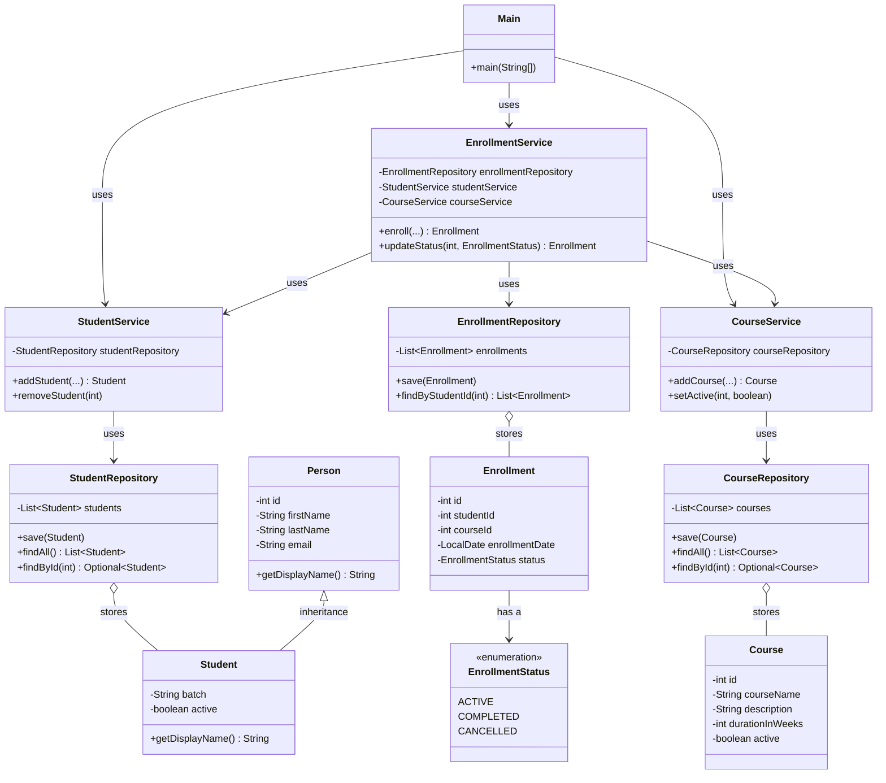

# LearnTrack — Student & Course Management System

A console-based Student & Course Management System built in Core
Java. Admins can manage students, courses, and enrollments through a
menu-driven terminal interface, with all data held in memory for the
lifetime of the program.

This project was built as a fundamentals exercise — no frameworks,
no database, no concurrency. Just plain Java: classes, objects,
constructors, encapsulation, basic inheritance/polymorphism,
`ArrayList`, and `try-catch`.

## Features

**Student Management**
- Add a new student (with or without email — constructor/method overloading)
- View all students
- Search a student by ID
- Deactivate a student (soft delete — sets `active = false`, doesn't remove the record)

**Course Management**
- Add a new course (with or without a description)
- View all courses
- Activate / deactivate a course

**Enrollment Management**
- Enroll a student in a course (blocks enrollment if either is inactive)
- View all enrollments for a given student
- Mark an enrollment as `COMPLETED` or `CANCELLED`

## How to Compile and Run

Requires JDK 17+ (built and tested on JDK 21). See
[`docs/Setup_Instructions.md`](docs/Setup_Instructions.md) if you
need to install one.

From the project root:

```bash
# Compile everything into an `out/` directory
find src -name "*.java" > sources.txt
javac -d out @sources.txt

# Run
java -cp out com.airtribe.learntrack.Main
```

Or, if your shell doesn't support `find`/`@sources.txt` well (e.g.
some Windows setups), compile directly:

```bash
javac -d out src/com/airtribe/learntrack/**/*.java src/com/airtribe/learntrack/*.java
java -cp out com.airtribe.learntrack.Main
```

**Running from an IDE:** import the project, mark `src` as the
source root, and run `com.airtribe.learntrack.Main`.

## Project Structure

```
src/com/airtribe/learntrack/
├── Main.java              # Menu-driven console entry point
├── entity/                # Person, Student, Course, Enrollment
├── repository/            # In-memory ArrayList-backed storage
├── service/                # Business logic + validation
├── exception/              # EntityNotFoundException, InvalidInputException
├── util/                   # IdGenerator, InputValidator
├── constants/               # AppConstants, MenuOptions
└── enums/                    # EnrollmentStatus, CourseStatus
```

See [`docs/Design_Notes.md`](docs/Design_Notes.md) for the reasoning
behind these choices — why `ArrayList` over arrays, where statics
were used, and what the `Person → Student` inheritance actually buys.

## Class Diagram



## Documentation Index

- [`docs/Setup_Instructions.md`](docs/Setup_Instructions.md) — JDK setup and "Hello World" check
- [`docs/JVM_Basics.md`](docs/JVM_Basics.md) — JDK vs JRE vs JVM, bytecode, portability
- [`docs/Design_Notes.md`](docs/Design_Notes.md) — architectural reasoning

## Known Limitations

Everything is in-memory only — closing the program wipes all data.
No persistence layer was in scope for this stage of the project.
